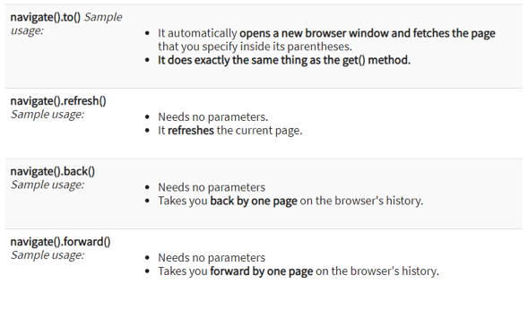
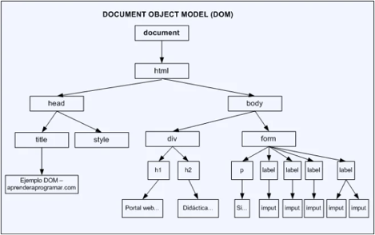
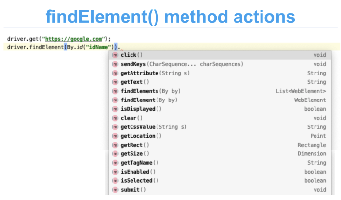

__Navigate methods__
 
 

__DOM__ (Document Object Model)

* Is an application programming interface (API) for valid html document.
* It defines logical structure of the a document and the way the document is accessed and manipulated.

What is Web Element?
  
Types of Web Elements:
* Edit Box
* Link
* Button
* Image
* Text area
* Checkbox
* Radio button
* Dropdown list
 

__Selenium locators__

1. id
2. name
3. className
4. tagName
5. linkText
6. partialLinkText
7. css
8. xpath

 

_driver.findElement()_
 

* Anything present on the webpage such as textbox, text, button, link, table, radio button, checkbox, etc. are called webElement.
* Before performing any action suck as click, type, select etc. on a webElement, selenium has to identify those elements uniquely.
* Method is used to access any single webElement on the web page.
* It returns the first matching element
* Method will throw NoSuchElementException when it fails to locate the element.

 

 
