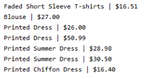
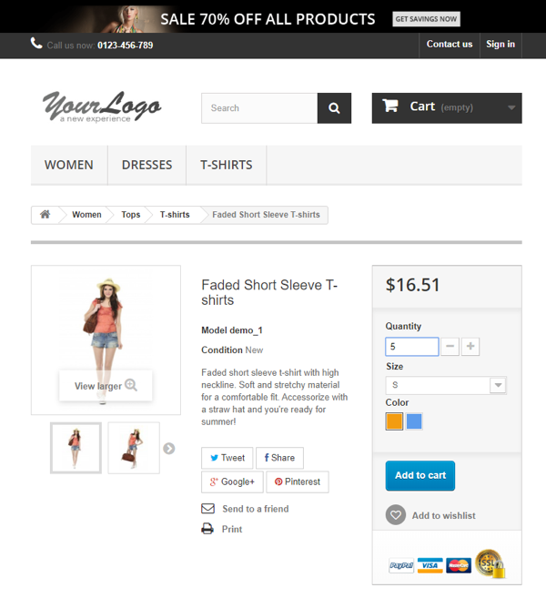
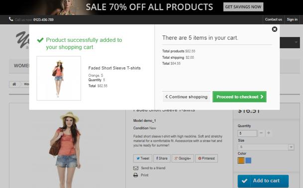
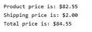
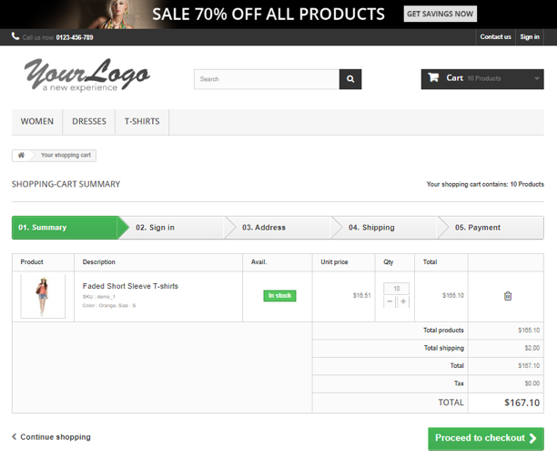
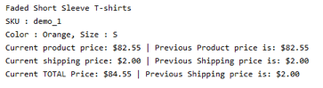

# TEAM PROJECT

##### Every team member should finish and submit in order to successfully complete the task.
_NOTE: Team work is very important when you are working on a project. It helps to deliver the finished product on time and with best results. Please help each other and try to get it done together_

 
 

* Navigate to http://automationpractice.com/
* Print out every product name and price under Popular section

* Output should look as following:

* In "Quantity" field input "5"

* Save as a variable and print out prices of the following fields: 
  * Total products
  * Total shipping
  * Total price
* Then Press "Proceed to checkout" button

* Output should look like:

* Print out product description
* Capture following data: 
  * Total products price
  * Total shipping price
  * Total price
* Verify against captured prices above
* Print out the result in good format

* Output example:

