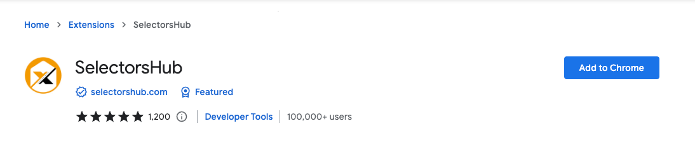
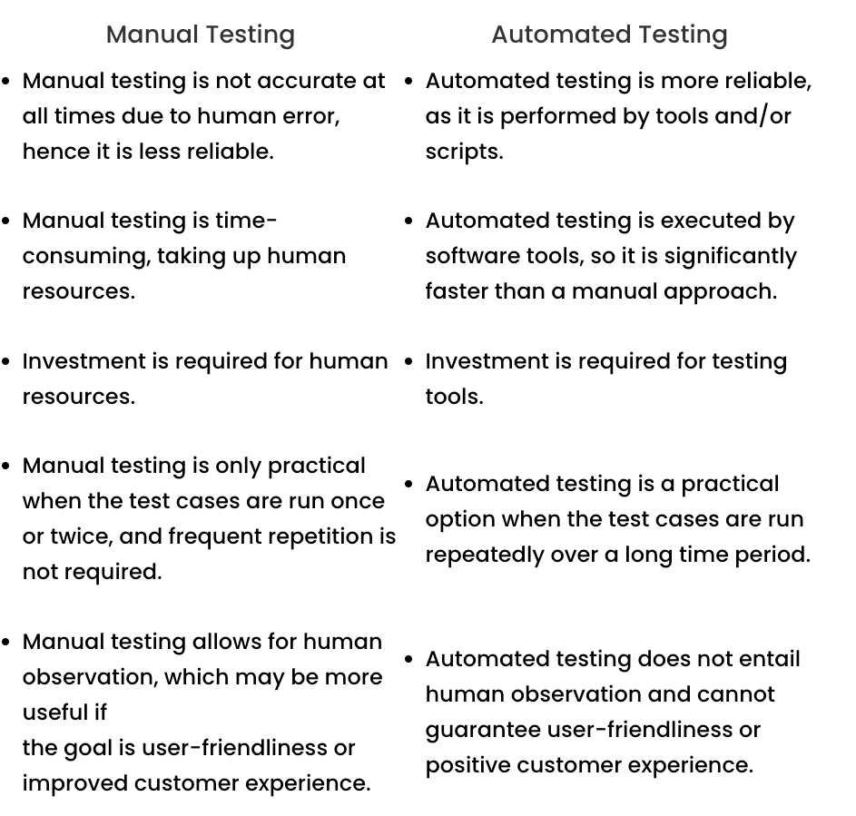
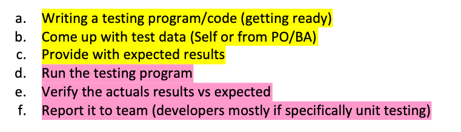

<h3> What is SelectorsHub? </h3>

<h3>Manual Testing vs Automated

<h3> What is TestNG? </h3>

TestNG in Selenium is a Java testing framework, inspired by JUnit and NUnit.  
It overcomes the constraints and disadvantages of JUnit and introduces an entirely new set of properties,  
making TestNG more powerful and easy to use. The suffix ‘NG’ stands for Next Generation,  
signifying the new functionalities that TestNG brings to the table. From simple unit testing to complex integrated testing,  
it is designed to simplify all your testing requirements such as functional testing, regression, end-to-end testing, and more.

<h3> Test Source Root vs Source Root? </h3>
 

<h3> Testing consist of following: </h3>

